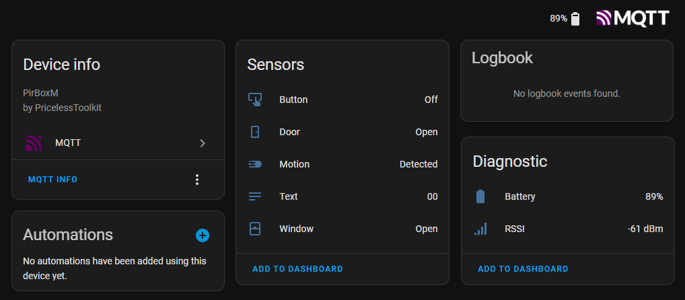
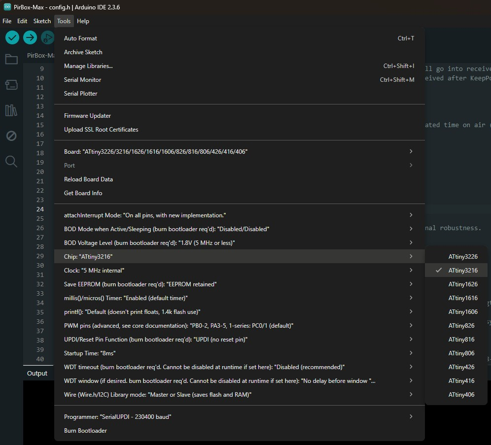
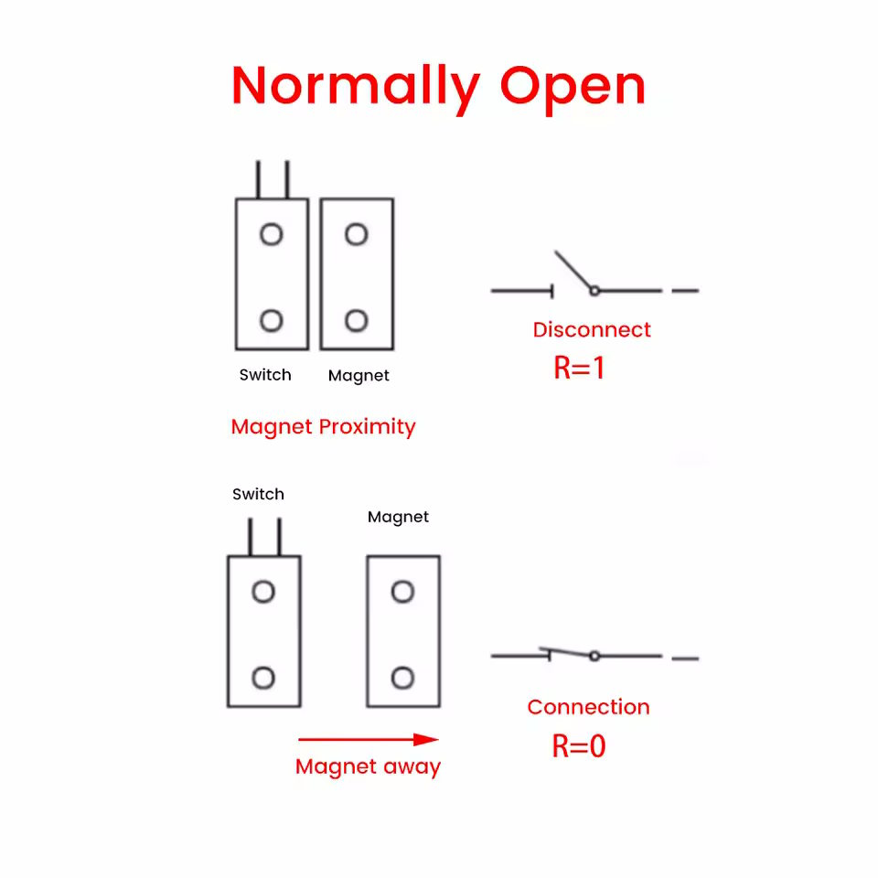
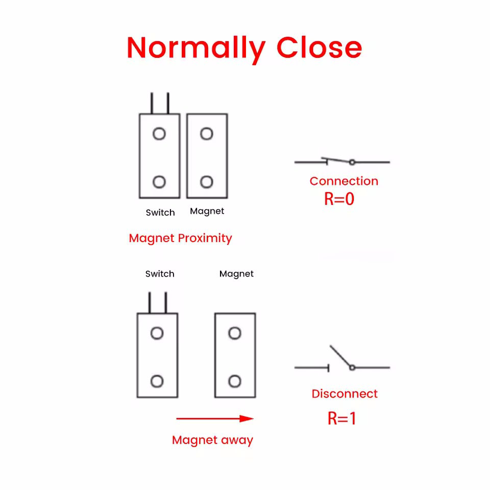
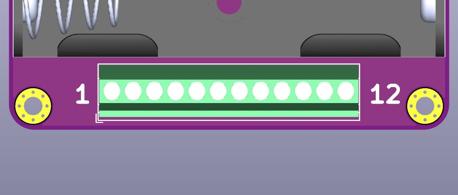
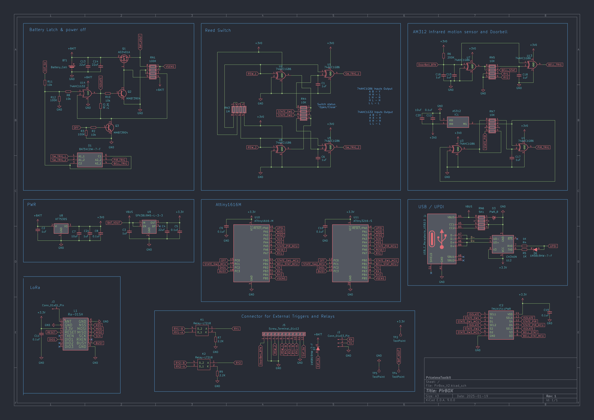

🤗 Please consider subscribing to my [YouTube channel](https://www.youtube.com/@PricelessToolkit/videos)
Your subscription goes a long way in backing my work. If you feel more generous, you can buy me a coffee


[](https://ko-fi.com/U6U2QLAF8)

## PirBOX-MAX and [PirBOX-LITE](https://github.com/PricelessToolkit/PirBOX-LITE)

**PirBOX-MAX** is an Open-Source, compact, low-power LoRa-based PIR motion sensor designed for long-range applications such as basements, underground garages/parking areas, and remote sheds. In addition to motion detection, PirBOX-MAX features inputs for reed switches, SSR (solid-state relay) control, and a push-button input, enabling it to monitor doors/windows, control loads, or be used as a remote gate sensor and doorbell.




#### 🛒 Coming soon to my shop. http://www.PricelessToolkit.com

### ✨ Key Features:
- Seamless integration with **Home Assistant MQTT**  
- **LoRa-based communication** with **two-way support** for remote control and feedback  
- **PIR Motion sensor** (Detected / Cleared) 
- **Two reed switch inputs** (supports both Normally Open and Normally Closed configurations)
- - Door and  Windows entities in Home Assistant
- **Two SSR (solid-state relay) outputs** for controlling lights, gates, or other loads  
- **One button input** perfect for use as a **doorbell-style button on a remote gate**  
- **Screw terminals** for all inputs and outputs for secure and simple wiring  
- **Ultra-low power consumption**: ~12 µAh during active or inactive periods  
- Powered by **3× AAA 1.5V batteries** for extended runtime  
- Also supports **external 5V power supply** for flexible deployment  
- Perfect for remote monitoring and control where Wi-Fi or Zigbee fall short


> [!NOTE]
> **Not intended** for indoor use or high traffic areas, Zigbee devices are better suited for that.  

### 📋 Power Consumption Table
Measured by "Power Profiler KIT 2"

| Condition                         | Current Draw / Usage | Battery Life (approx.)                          |
|----------------------------------|-----------------------|-------------------------------------------------|
| No motion detected               | 12 µA                 | ~11.4 years (1,200,000 µAh / 12 µA)*            |
| Constant motion detected         | 12 µA                 | ~11.4 years (1,200,000 µAh / 12 µA)*            |
| Single status transmission (~500 ms) | 16 µAh             | ~60,000 Transmission*         |

> [!NOTE]
> \*All values are **theoretical estimates** based on lab measurements using a Nordic **Power Profiler Kit II**.  
Actual battery life will vary depending on battery quality, temperature, transmission frequency, and whether the device is configured for **one-way or two-way LoRa communication**, among other factors.


### Required:
- LoRa Gateway [CapiBridge](https://github.com/PricelessToolkit/CapiBridge) for full functionality or the one-way version [LilyGo LoRa Board](https://github.com/PricelessToolkit/TTGO_Gateway) *not all features are available.
- 3 x AAA 1.5v Battery.

## ⚙️ Configuration / Reflashing:
> [!NOTE]
> By default, it comes already flashed and tested with the default firmware. Code"xy"

1. Install `MegaTinyCore` in Arduino IDE "http://drazzy.com/package_drazzy.com_index.json"
2. Download the PirBOX-MAX project file; don't just copy and paste the code.
3. Open the PirBox-MAX.ino file in Arduino IDE. "It will include all necessary files and Radio Library."
4. In Config.h, change the sensor name, gateway key, Logic, and radio settings based on your gateway config

> [!IMPORTANT]
>  Configure the "Logic" part correctly! Set Power to "Battery" or "External", and if you don't need 2-way communication, set "TwoWayCom" to "False". All sensor logic depends on these settings.

> [!IMPORTANT]  
> The PirBOX LoRa module uses the sync word `0x1424`, which is equivalent to the CapiBridge's `0x12` sync word.

```cpp

/////////////////////////// LoRa Gateway Key ///////////////////////////

#define GATEWAY_KEY "xy"          // Keep it Short
#define NODE_NAME "PirBoxM"       // Sensor Name which will be visible in Home Assistant

//////////////////////////// Logic //////////////////////////////////////

#define Power "Battery"           // Can be "Battery" or "External"
#define TwoWayCom  "False"        // "True" or "False", If True, after sending sensor data, it will go into receiver mode and will wait "KeepPowerON_Time" for commands.
#define KeepPowerON_Time 15       // Waiting xx seconds to receive command; if no command is received after KeepPowerON_Time it will power off.
#define RelayOn_Time     1        // How much time relays will keep contact.

////////////////////////////// LORA CONFIG //////////////////////////////


#define BAND                      868E6     // 433E6 MHz or 868E6 MHz or 915E6 MHz
#define TX_OUTPUT_POWER           20        // dBm tx output power
#define LORA_BANDWIDTH            4         // bandwidth 2: 31.25Khz, 3: 62.5Khz, 4: 125Khz, 5: 250KHZ, 6: 500Khz
#define LORA_SPREADING_FACTOR     8         // spreading factor 6-12 [SF5..SF12]
#define LORA_CODINGRATE           1         // [1: 4/5, 2: 4/6, 3: 4/7, 4: 4/8]
#define LORA_PREAMBLE_LENGTH      6         // Same for Tx and Rx
#define LORA_PAYLOADLENGTH        0         // 0: Variable length packet (explicit header),  1..255 for Fixed length packet (implicit header)
#define LORA_CRC_ON               true
#define LORA_SYNC_WORD            0x1424    // The 0x1424 private sync word is equivalent to the CapiBridge 0x12 sync word.

```

5. Select board configuration as shown below.



6. Disconnect the Battery if connected. Then connect the USB cable to the PirBOX-Max.

> [!NOTE]
> To access the USB port, unscrew the housing. The port is hidden inside and is not intended for use while batteries are installed.

7. In Arduino IDE, select the COM Port and programmer "SerialUPDI-230400 baud
8. Click "Upload Using Programmer" or "Ctrl + Shift + U", Done!

If your gateway and sensor are configured correctly, you should see under MQTT Devices "PIRBoxL" or the custom name you assigned in the config.h file. Once it's visible under MQTT Devices, the next step is to create an automation in Home Assistant to send a notification to your mobile phone.


## 🔌Wiring

### The PirBOX-MAX can be powered externally.

- Connect **5V** to the **5V** pin.
- Connect **Ground** to the **GND** pin.
- A power supply providing **at least 150mA** is sufficient for stable operation.

> [!IMPORTANT] 
> If you choose to power the PirBOX-MAX using an external power source, **remove the batteries before connecting** the external power.  
> Also, ensure that you set the power configuration in `config.h` as shown below:

```cpp
#define Power "External" 
```
----------------------------

### The **PirBOX-MAX** supports two types of reed switches:
- **Normally Open (NO):** The circuit is open when idle and closes when activated.
- **Normally Closed (NC):** The circuit is closed when idle and opens when activated.

<table>
  <tr>
    <td align="center"><b>Normally Open (NO)</b></td>
    <td align="center"><b>Normally Closed (NC)</b></td>
  </tr>
  <tr>
    <td></td>
    <td></td>
  </tr>
</table>

----------------------------

### Momentary Button Input

The **PirBOX-MAX** includes support for a **momentary button input**, designed specifically for **Normally Open (NO)** buttons.

- This input **cannot be used with reed switches**.
- Compatible with common **doorbell-style** buttons **without internal lighting**, or any standard **momentary push-button**.
- The input is triggered when the button is pressed and held briefly.

> [!NOTE]
> The input is **not read at high speed**. The typical read interval is **200ms or more**, making it suitable for normal human finger presses, not for fast electronic switching or bounce-sensitive applications.
----------------------------
### Relays

The **PirBOX-MAX** is equipped with **two Solid State Relays (SSR)** labeled **R1** and **R2**.

- Each relay is rated for up to **2.5A** and is intended for **DC loads only**.
- SSRs act like **simple on/off switches**, controlled via firmware settings.

Relay behavior can be configured in the `config.h` file. For example, to set how long a relay stays active after receiving a LoRa command:

```cpp


#define TwoWayCom  "True"       // If True, after sending sensor data it will go into receiver mode and will wait "KeepPowerON_Time" for commands.
#define RelayOn_Time     1      // How much time (in seconds) the relays will keep contact.
```

----------------------------

## 🪛 Screw Terminal Pinout

The **PirBOX-MAX** features a 12-pin screw terminal. Below is the pinout and description of each terminal:



| Pin # | Name         | Description                          |
|-------|--------------|--------------------------------------|
| 1     | BN           | Momentary Button Input (NO only)     |
| 2     | BN           | Momentary Button Input (NO only)     |
| 3     | S2           | Reed Switch 2 Input — No polarity    |
| 4     | S2           | Reed Switch 2 Input — No polarity    |
| 5     | S1           | Reed Switch 1 Input — No polarity    |
| 6     | S1           | Reed Switch 1 Input — No polarity    |
| 7     | R2           | Relay 2 — No polarity                |
| 8     | R2           | Relay 2 — No polarity                |
| 9     | R1           | Relay 1 — No polarit                 |
| 10    | R1           | Relay 1 — No polarit                 |
| 11    | GND          | GND                                  |
| 12    | 5V           | 5V input,  "At least 150mA"          |


# Prefer to build it on your own?
This project is open-source and includes Source code, 3D Print files, and Gerber files, allowing you to order blank PCBs and assemble the PirBOX-Lite yourself. To help with manual assembly, I've included an Interactive HTML BOM in the PCB folder. This tool shows the placement and polarity of each component, helping to eliminate errors during soldering.


> [!NOTE]
>  Please note that POS (Pick and Place) files and KiCad source files are not included. These are intentionally omitted, as this project is intended for manual assembly. If you prefer a ready-to-use solution, you can purchase one directly from my shop: https://www.pricelesstoolkit.com.

## Schematic
<details>
  <summary>View schematic. Click here</summary>

</details>
